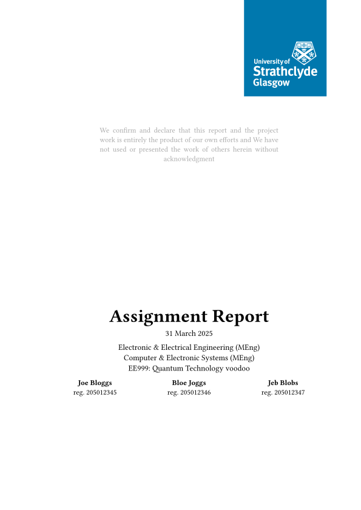

# opinionated-eng-strath
A 2in1 template for typical reports that an engineering degree at University of Strathclyde requires.

## Installing Local packages
For local use only right now. Tinymist and VSCode is recommended. Store the package here:

`{data-dir}/typst/packages/local/opinionated-eng-strath/{version}`

locally on your system. Here, `{data-dir}` is

- `$XDG_DATA_HOME` or `~/.local/share` on Linux (if you installed vscode and tinymist using snap or flatpack, make sure to find the apps home sanbox)
- `~/Library/Application Support` on macOS
- `%APPDATA%` on Windows

- Import from it with `#import "@local/opinionated-eng-strath:0.1.0": *`

## Getting started
check out the `/{version}/template` directory

```typst
#show: strathy.with(
  title: "Big Important Project"
  //takes in a list of dicts (name: full_name, reg: registration_number)
  authors: (
    (name: "Joe Bloggs", reg: "205012345"),
    (name: "Bloe Joggs", reg: "205012346"),
  ),
  declaration: [
  We confirm and declare that this report and the project work is entirely the product of our own efforts and We have not used or presented the work of others herein without acknowledgment
  ],
  abstract: [
    This is a space for the abstract you can also do this \
    #lorem(300)
  ],
  subtitle: [
  19520 5th year project \
  Department of Electronic and Electrical Engineering \
  University of Strathclyde, Glasgow
  ],
  // date: [your custom date]
  //default is datetime.today().display("[day] [month repr:long] [year]")
  // whether to gen a list of figs
  figures: true,
  // special space for the glossary, if using a glossary manager
  //glossary: [#print-index(title: "Definitions")],
  // whether to generate the typst ack at the bottom
  ack: true,
  // compact layeout for assignments, set to false for more "grandeur"
  compact: false
)
```
# Example Title Page
